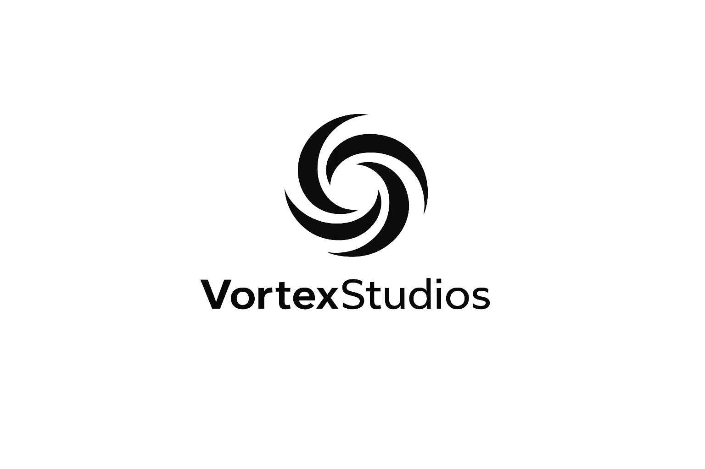

<div align="center">
  <picture>
    <source media="(prefers-color-scheme: dark)" srcset="public/logo-white.png">
    
  </picture>

  <h1>VortexStudios</h1>

  <p><strong>Automate Everything. Intelligent Web Systems.</strong></p>

  <p>
    Agencia digital enfocada en desarrollo web moderno, automatización con IA y diseño premium.
  </p>

  <p>
    <a href="mailto:vortex.proyect.g@gmail.com">vortex.proyect.g@gmail.com</a>
  </p>

  <p>
    <em>"Web Automation Studio." · "Built for Scale." · "Automation Meets Design."</em>
  </p>
</div>

---

## Sobre nosotros

**VortexStudios** es una agencia digital enfocada en desarrollo web moderno, automatización con IA y diseño premium. Creamos páginas **rápidas**, **seguras** y **visualmente impactantes** para empresas, restaurantes, startups y marcas que buscan destacar en internet.

Combinamos ingeniería, IA y diseño para entregar productos digitales que generan resultados reales.

## Servicios

| | Servicio | Descripción |
| --- | --- | --- |
| 01 | **Desarrollo Web Moderno** | Sitios construidos con Next.js, React y Tailwind. Rápidos, accesibles y listos para producción. |
| 02 | **Automatización con IA** | Chatbots, generación de contenido, flujos automáticos y agentes personalizados para tu negocio. |
| 03 | **Diseño Premium** | Identidad visual cuidada al detalle. Interfaces que comunican confianza. |
| 04 | **Built for Scale** | SEO técnico, performance, seguridad y despliegues globales en edge. |

## Para quién

- Empresas
- Restaurantes
- Startups
- Marcas personales
- E-commerce
- SaaS

## Stack

- **Framework**: [Next.js 16](https://nextjs.org) (App Router)
- **Lenguaje**: TypeScript
- **Estilos**: [Tailwind CSS v4](https://tailwindcss.com)
- **UI**: React 19
- **Fuentes**: Geist Sans & Geist Mono
- **Deploy**: Vercel · Edge Network · Cloudlfare

## Estructura

```
VortexStudios/
├── public/                 # Logos y assets estáticos
│   ├── logo.png
│   └── logo-transparent.png
├── src/
│   └── app/
│       ├── icon.png        # Favicon
│       ├── layout.tsx      # Layout + metadata SEO
│       ├── page.tsx        # Landing page
│       └── globals.css     # Tema (dark + neon)
├── next.config.ts
├── tsconfig.json
└── package.json
```


## Contacto

¿Tienes un proyecto en mente? Escríbenos:

**vortex.proyect.g@gmail.com**

Respondemos en menos de 24 horas con una propuesta inicial.

---

<div align="center">
  <sub>© VortexStudios — Automate Everything.</sub>
</div>
